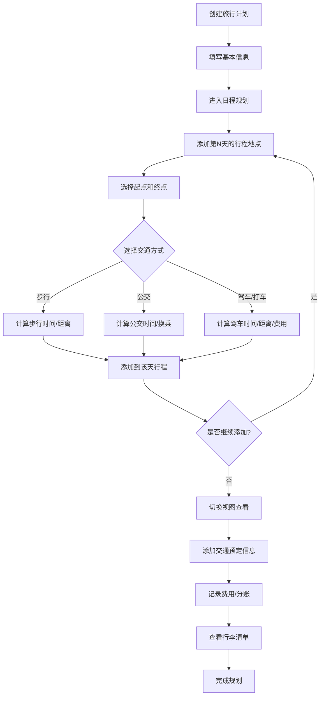

# 旅游攻略管家 - 产品需求文档

## 1. 产品概述

一款面向自由行用户的旅游行程规划与管理工具。用户可以创建多日旅行计划，按天规划行程，计算地点间的交通时间与费用，管理航班/火车/大巴等预定信息，支持多币种记账与AA分账，并提供行李备忘录功能。

- **目标用户**：自由行旅行者、小团体出游用户
- **核心价值**：一站式管理旅行中的行程、交通、住宿、费用和备忘，解决信息分散在多个App/文档中的痛点

## 2. 核心功能

### 2.1 功能模块

1. **行程管理页**：创建/编辑/删除旅行计划，概览所有行程
2. **日程规划页**：按天规划行程，添加地点和交通方式，多视图切换
3. **交通预定页**：管理航班/高铁/火车/大巴等固定交通信息
4. **记账分账页**：多币种费用记录，AA分账或个人记账
5. **行李备忘录**：分类打包清单，勾选状态追踪

### 2.2 页面详情

| 页面名称 | 模块名称 | 功能描述 |
|---------|---------|---------|
| 行程管理 | 行程列表 | 展示所有旅行计划卡片，显示行程名称、日期、天数、目的地 |
| 行程管理 | 创建行程 | 填写行程名称、目的地、日期范围、参与人数创建新行程 |
| 日程规划 | 天列表 | 左侧按天显示行程列表，可折叠/展开每天的内容 |
| 日程规划 | 地点卡片 | 每天可添加多个地点，显示地点名称、地址、备注、预计停留时间 |
| 日程规划 | 路线计算 | 选择两地之间的交通方式（步行/公交/驾车），调用地图API计算时间和距离 |
| 日程规划 | 费用估算 | 根据交通方式估算费用（国际-Uber计价参考，国内-滴滴计价参考） |
| 日程规划 | 视图切换 | 支持表格视图、时间线视图、地图视图三种展示方式 |
| 日程规划 | 地图视图 | 在地图上展示当天所有地点，连线显示路线 |
| 交通预定 | 交通列表 | 展示所有预定交通信息，按类型分类（飞机/高铁/火车/大巴） |
| 交通预定 | 添加交通 | 填写类型、班次号、出发/到达地点和时间、座位号、备注 |
| 交通预定 | 酒店信息 | 入住/退房日期、酒店名称、地址、确认号 |
| 记账分账 | 费用列表 | 按类别展示所有费用（交通/住宿/餐饮/门票/购物/其他） |
| 记账分账 | 添加费用 | 填写金额、币种、类别、日期、付款人、备注 |
| 记账分账 | AA分账 | 自动按人数均摊费用，显示每人应付金额和结算状态 |
| 记账分账 | 汇率换算 | 多币种输入，默认人民币，支持实时或手动汇率换算 |
| 行李备忘 | 分类清单 | 预设分类（证件/衣物/电子/洗漱/药品/其他），可自定义 |
| 行李备忘 | 物品勾选 | 每项可勾选已备/未备状态 |

## 3. 核心流程

## 4. 界面设计

### 4.1 设计风格

- **色调**：以白色和浅灰为基调，采用蓝色（#2563EB）作为主色调，橙色（#F59E0B）作为强调色
- **字体**：标题使用带衬线的优雅字体（如 Playfair Display），正文使用清晰的无衬线字体（如 Noto Sans SC）
- **布局**：左侧固定导航栏 + 右侧内容区，卡片式内容布局
- **风格**：简约现代，大量留白，圆角卡片，柔和阴影
- **图标**：使用简洁的线性图标

### 4.2 页面设计概览

| 页面名称 | 模块名称 | UI元素 |
|---------|---------|--------|
| 行程管理 | 行程列表 | 卡片网格布局，每个卡片含目的地图片占位、日期、天数标签 |
| 行程管理 | 创建行程 | 模态弹窗，表单输入，日期选择器，人数选择 |
| 日程规划 | 天列表 | 左侧竖列，当前天高亮，可折叠 |
| 日程规划 | 地点卡片 | 拖拽排序卡片，含地点名、地址、交通方式图标、时间信息 |
| 日程规划 | 地图视图 | 全宽地图，标记点带数字标签，路线连线 |
| 日程规划 | 视图切换 | 顶部Tab切换（表格/时间线/地图），带图标 |
| 交通预定 | 交通卡片 | 横向时间线样式，左侧时间轴，右侧卡片内容 |
| 记账分账 | 费用表格 | 可排序表格，币种标签，合计行高亮 |
| 行李备忘 | 分类区域 | 折叠面板，每项带复选框，进度条显示完成度 |

### 4.3 响应式设计

- 桌面端优先设计（1280px+ 最佳体验）
- 平板端（768px-1279px）：左侧导航折叠为汉堡菜单
- 移动端（<768px）：单列布局，卡片全宽，地图缩小

## 5. 外部API集成

| API服务 | 用途 | 是否必须 |
|---------|------|---------|
| 高德地图 JS API | 地理编码、路线规划（驾车/步行/公交/骑行） | 推荐（国内） |
| Google Maps API | 地理编码、路线规划（国际） | 可选 |
| 百度地图 API | 地理编码、路线规划 | 可选 |
| Open-Meteo | 天气预报（免费，无需Key） | 推荐 |
| OpenStreetMap / Leaflet | 地图展示（免费，无需Key） | 默认 |

## 6. 数据存储

- 所有数据存储在浏览器 LocalStorage 中
- 支持导出/导入 JSON 格式的旅行数据
- 无需后端服务器