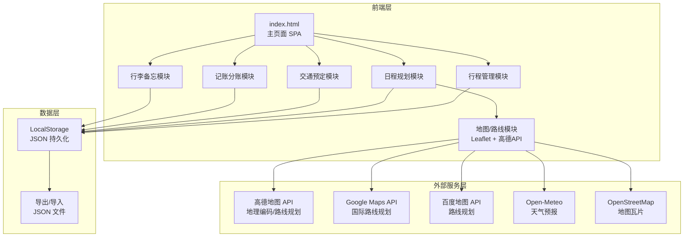
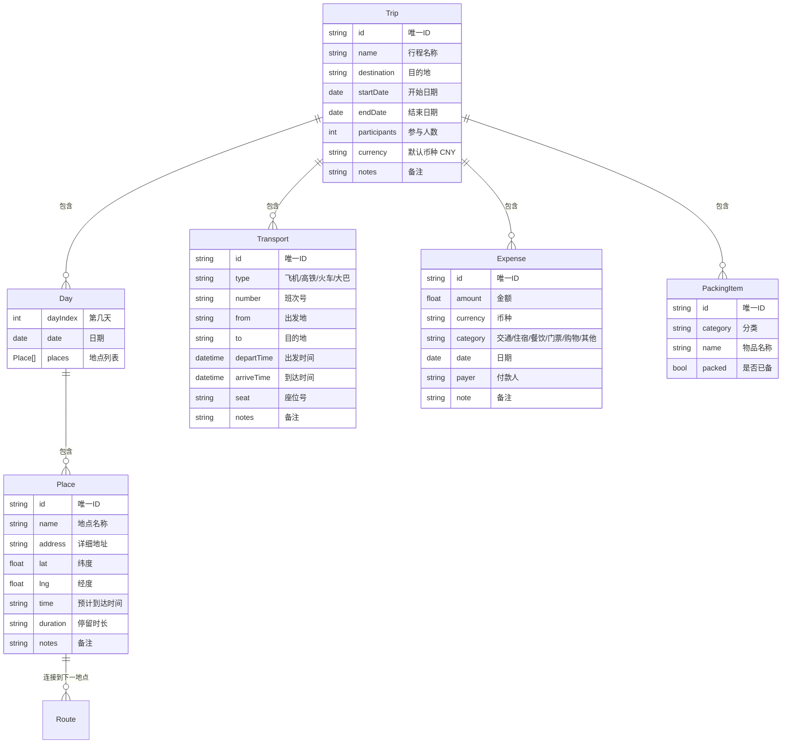

# 旅游攻略管家 - 技术架构文档

## 1. 架构设计



## 2. 技术选型

- **前端框架**：原生 HTML5 + CSS3 + JavaScript (ES6+)，无框架依赖
- **构建工具**：无需构建，直接打开 HTML 文件即可运行
- **地图库**：Leaflet.js 1.9.4（CDN引入）+ OpenStreetMap 瓦片
- **地图API**：高德地图 JS API 2.0（地理编码和路线规划）
- **天气API**：Open-Meteo（免费，无需API Key）
- **数据存储**：浏览器 LocalStorage
- **图标**：Lucide Icons（CDN引入）
- **字体**：Google Fonts（Playfair Display + Noto Sans SC）

## 3. 文件结构

```
travel/
├── index.html          # 主页面（单文件应用）
├── css/
│   └── style.css       # 样式文件
├── js/
│   ├── app.js          # 应用主入口，模块协调
│   ├── store.js        # 数据存储管理（LocalStorage CRUD）
│   ├── trip.js         # 行程管理模块
│   ├── itinerary.js    # 日程规划模块
│   ├── transport.js    # 交通预定模块
│   ├── finance.js      # 记账分账模块
│   ├── packing.js      # 行李备忘模块
│   ├── map.js          # 地图与路线计算模块
│   ├── weather.js      # 天气模块
│   └── utils.js        # 工具函数（日期、货币、格式化）
└── .trae/
    └── documents/      # 项目文档
```

## 4. 数据模型

### 4.1 实体关系



### 4.2 数据结构（JSON）

```javascript
// LocalStorage 存储结构
{
  "travel_app_data": {
    "trips": [
      {
        "id": "trip_001",
        "name": "韩国东海岸 7天6夜",
        "destination": "韩国",
        "startDate": "2026-10-01",
        "endDate": "2026-10-07",
        "participants": 2,
        "currency": "CNY",
        "notes": "",
        "days": [
          {
            "dayIndex": 1,
            "date": "2026-10-01",
            "places": [
              {
                "id": "place_001",
                "name": "大邱国际机场",
                "address": "韩国大邱广域市东区",
                "lat": 35.8967,
                "lng": 128.6556,
                "time": "14:00",
                "duration": "0.5h",
                "notes": "航班抵达",
                "transportToNext": {
                  "mode": "driving",
                  "distance": 12.5,
                  "duration": 25,
                  "cost": 85,
                  "costCurrency": "CNY"
                }
              }
            ]
          }
        ],
        "transports": [
          {
            "id": "trans_001",
            "type": "flight",
            "number": "OZ358",
            "from": "上海浦东",
            "to": "大邱",
            "departTime": "2026-10-01T11:00:00",
            "arriveTime": "2026-10-01T14:00:00",
            "seat": "23A",
            "notes": "韩亚航空"
          }
        ],
        "expenses": [],
        "packingItems": [],
        "exchangeRates": {}
      }
    ],
    "settings": {
      "mapProvider": "amap",
      "amapKey": "",
      "googleKey": "",
      "baiduKey": "",
      "defaultCurrency": "CNY"
    }
  }
}
```

## 5. 路线计算模块设计

### 5.1 支持的交通方式

| 方式 | 高德API | Google API | 说明 |
|------|---------|-----------|------|
| 步行 | Walking | WALKING | 显示距离和时间 |
| 公交/地铁 | Transit | TRANSIT | 显示换乘方案 |
| 驾车 | Driving | DRIVING | 显示距离、时间和路况 |
| 骑行 | Riding | BICYCLING | 显示骑行路线 |

### 5.2 费用估算逻辑

- **国内驾车**：按高德返回的距离 × 滴滴计价规则（起步价 + 里程费 + 时长费）粗略估算
- **国际驾车**：按距离 × 当地Uber计价系数粗略估算
- **公交/步行**：免费或显示公共交通票价

## 6. 天气模块

- 使用 Open-Meteo API（免费，无需Key）
- 请求地址：`https://api.open-meteo.com/v1/forecast`
- 支持 16 天预报
- 在每日行程顶部显示该日天气概况